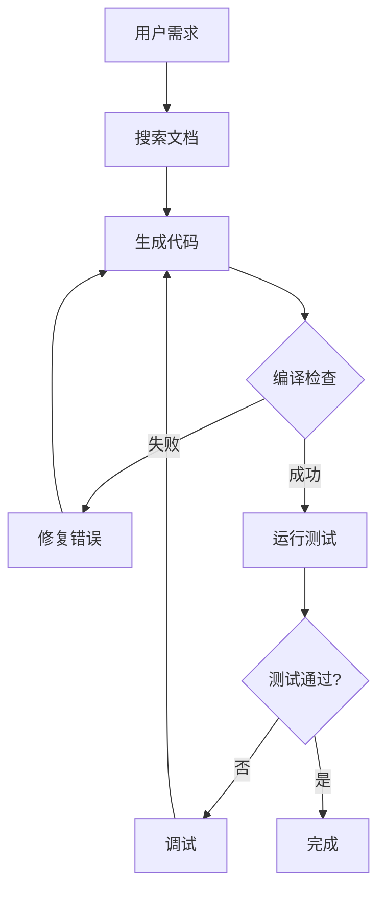
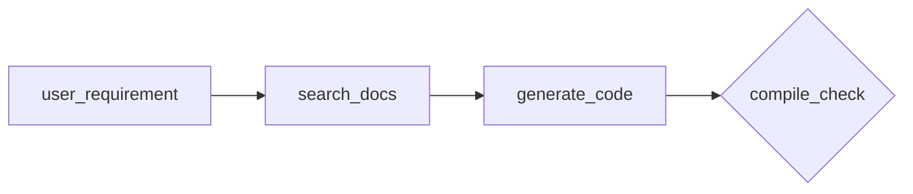

# TencentDB Agent Memory 面试总结（详尽版）

> 基于四层记忆系统的 AI 代理插件设计思路
>
> 适用场景：系统设计面试、架构设计讨论、技术深度交流

---

## 一、问题背景与动机

### Q1: AI 代理面临的核心问题是什么？Agent Memory 想解决什么？

**问题背景**

AI 代理（Agent）在处理长对话、长任务时面临两个根本矛盾：

| 矛盾 | 表现 | 后果 |
|------|------|------|
| **上下文遗忘** | LLM 的 context window 有限 | 早期信息被后续对话挤出，历史细节丢失 |
| **上下文膨胀** | 记忆越多 → token 越多 → 成本越高 → 性能下降 | 长对话变得不可用 |

**举个例子**：

```
用户第1轮：我用的是 Mac + VSCode
用户第5轮：我习惯用 tabs 不是 spaces
用户第20轮：（Agent 忘记了 Mac 这个事实，开始建议 Windows 方案）
```

或者反面：

```
用户持续对话 100 轮
→ 每次都把完整历史塞进 context
→ 50 万 token
→ LLM 开始"忘记"近期指令
→ 推理变慢、幻觉增加
```

**Agent Memory 的解决思路**

不是简单地"记住更多"，而是：
1. **分层记忆**：把记忆分成四层，按重要性递增
2. **符号化压缩**：用 Mermaid 等紧凑格式替代自然语言
3. **按需召回**：不是每次都加载全部记忆，而是智能检索

**实际效果**：

| 指标 | 优化前 | 优化后 | 改善 |
|------|--------|--------|------|
| Token 消耗 | 221.31M | 85.64M | **-61.38%** |
| 任务通过率 | 33% | 50% | **+51.52%** |

---

### Q2: 为什么传统的"向量检索 + RAG"方案不够用？

**传统 RAG 的问题**

```
用户查询 → 向量数据库 → 返回 top-k 相关片段 → 塞进 context
```

这种方法有三个根本缺陷：

**1. 召回是"盲搜索"**

```python
# 传统 RAG 的问题示例
query = "用户对代码质量有什么要求？"
results = vector_db.search(query, top_k=5)

# 可能返回：
# - 用户抱怨 BUG 的 10 段对话（不相关）
# - 讨论 CI/CD 的片段（边缘相关）
# - 真正的代码风格偏好（淹没在噪声中）
```

问题是：向量相似度 ≠ 语义相关性，更不等于"对当前任务有用的上下文"。

**2. 缺乏宏观结构**

用户偏好、工作习惯、沟通风格 这些高层信息，在向量库中被切碎成孤立片段：

```
向量库里的内容：
- "用户喜欢用 tabs"（来自第3轮）
- "用户用 Mac"（来自第1轮）
- "用户反馈代码不规范"（来自第7轮）
- "用户说调试困难"（来自第12轮）

Agent 无法推断：用户是 Mac + tabs 的开发者，对代码规范性敏感。
```

**3. 无法追溯**

```python
# Agent 说："根据你的习惯，我建议..."
# 用户问："你怎么知道的？"
# Agent 无法回答，因为不知道这个结论来自哪个记忆
```

---

## 二、四层记忆系统详解

### Q3: 四层记忆（L0/L1/L2/L3）的设计思路是什么？

**核心思想：渐进式抽象**

```
L0: 原始对话 ──────────────────────────────────→ 证据层（100% 原始）
L1: 原子记忆 ──────────────────────────────────→ 结构化层（70% 抽象）
L2: 场景块 ────────────────────────────────────→ 主题层（40% 抽象）
L3: 画像 ──────────────────────────────────────→ 画像层（10% 抽象）
```

**为什么这样分层？**

类比人类记忆：
- L0 像大脑中的"录像带"——完整但无法全部回忆
- L3 像大脑中的"刻板印象"——最精炼但可能失真
- 中间层提供平衡：足够抽象以节省空间，又保留足够细节

**每层的具体设计**

---

#### L0：对话原始层 —— "不可篡改的证据"

**职责**：原始对话存档，类似"行车记录仪"

**为什么需要？**
- LLM 在召回过程中可能"污染"对话（把自己的回复当作用户输入）
- 需要原始文本用于审计和追溯
- 极端情况下可以重建整个对话历史

**数据格式**：
```jsonl
{"sessionKey":"sess_abc123","role":"user","content":"帮我写个排序算法","timestamp":1716200000}
{"sessionKey":"sess_abc123","role":"assistant","content":"这是一个快速排序实现...","timestamp":1716200010}
{"sessionKey":"sess_abc123","role":"tool","content":"代码执行完成，输出：[1,2,3,5]","timestamp":1716200020}
```

**关键设计点**：

```typescript
// 1. 增量游标：避免重复捕获
lastCursor: string  // 上次读取到的位置

// 2. originalUserText：保留用户原始输入
// 因为召回时可能替换了用户消息，需要保留原始版本
originalUserText: message.content

// 3. sanitize：防止注入污染
// 过滤掉 < injected > 等标签
// 过滤掉 tool_call 等内部指令
sanitizedContent = sanitize(message.content)
```

**适用场景**：
- Agent 产生幻觉时，追溯真实对话
- 用户投诉"我明明说的是 X"时，验证原始输入
- 极端重放场景的完整恢复

---

#### L1：原子结构化层 —— "LLM 提取的关键事实"

**职责**：从对话中提取原子级的结构化记忆

**为什么需要？**
- L0 是"录像"，L1 是"笔记"
- 直接查 L0 太慢，需要更结构化的索引
- 为 L2/L3 提供原材料

**三种记忆类型**：

```typescript
// 1. persona（画像类）
// 关于用户本身的信息：偏好、习惯、身份
{
  type: "persona",
  content: "用户是 Mac 用户，习惯用 tabs 缩进",
  extracted_from: "sess_abc123:line_15-20"
}

// 2. episodic（事件类）
// 发生过的事件：任务、问题、解决方案
{
  type: "episodic",
  content: "用户上周遇到数据库连接池耗尽问题，通过增加 max_connections 解决",
  extracted_from: "sess_xyz789:line_50-80"
}

// 3. instruction（指令类）
// 用户给出的明确规则、约束、SOP
{
  type: "instruction",
  content: "用户要求所有 API 必须有 OpenAPI 文档",
  extracted_from: "sess_abc123:line_10"
}
```

**提取过程**：

```typescript
// l1-extractor.ts 的核心逻辑
async function extractL1(conversation: Message[]): Promise<L1Record[]> {
  // 1. 过滤低价值消息
  const filtered = conversation.filter(shouldExtractL1)

  // 2. 调用 LLM 提取
  const llmOutput = await llm.run(`
    从以下对话中提取关键记忆：
    ${filtered.map(m => `${m.role}: ${m.content}`).join('\n')}

    记忆类型：persona（偏好）、episodic（事件）、instruction（规则）
    格式：JSON 数组
  `)

  // 3. 解析 + 两阶段去重
  const records = JSON.parse(llmOutput)
  return await deduplicateAndMerge(records)
}
```

**质量门控**：

```typescript
function shouldExtractL1(message: Message): boolean {
  // 长度过滤：太短的消息没有信息量
  if (message.content.length < 50) return false

  // 类型过滤：工具调用日志不需要提取
  if (message.role === 'tool') return false

  // 系统消息通常不需要提取
  if (message.role === 'system') return false

  // 注入检测：防止恶意内容
  if (containsInjection(message.content)) return false

  return true
}
```

**与 L0 的关系**：
```
L0: "我习惯用 tabs 不是 spaces，而且我是 Mac 用户"
         ↓ LLM 提取
L1: {"type": "persona", "content": "用户偏好 tabs 缩进，Mac 用户"}
         ↓ result_ref 链接
L0: sess_abc123:line_15（可追溯）
```

---

#### L2：场景聚合层 —— "主题化的记忆块"

**职责**：将零散的 L1 记忆聚合成主题场景

**为什么需要？**

假设 L1 有 100 条记忆，直接召回会导致：
```
100 条 L1 → 每条 50 tokens → 5000 tokens
```

按场景组织后：
```
相关场景（5个）× 每场景 100 tokens = 500 tokens（-90%）
```

**场景示例**：

```markdown
# 场景：数据库优化项目

## 背景
用户正在进行一个性能敏感的项目，涉及数据库查询优化。

## 已知信息
- 项目使用 PostgreSQL 12
- 用户反馈查询延迟高达 5s
- 已实施的优化：索引、连接池、缓存

## 相关 L1 记录
- record_001: 用户提到使用 PostgreSQL
- record_042: 反馈查询慢的问题
- record_089: 提到添加了索引

## 时间线
2024-03-01: 开始项目
2024-03-05: 反馈性能问题
2024-03-10: 添加索引，延迟降到 1s

## 状态
[进行中]
```

**LLM Agent 自主操作场景**

L2 的独特之处：LLM Agent 可以直接操作场景文件

```typescript
// scene-extractor.ts 提供给 LLM 的工具
const tools = [
  {
    name: "CREATE_SCENE",
    description: "创建新场景",
    params: { title, content }
  },
  {
    name: "UPDATE_SCENE",
    description: "更新场景内容",
    params: { sceneId, content }
  },
  {
    name: "MERGE_SCENES",
    description: "合并两个场景",
    params: { sourceId, targetId }
  },
  {
    name: "DELETE_SCENE",
    description: "软删除场景（标记 [DELETED]）",
    params: { sceneId }
  }
]

// 约束：workspaceDir 限制在 scene_blocks/ 内（沙箱）
```

**场景数量控制**：

```typescript
const MAX_SCENES = 15

if (sceneCount >= MAX_SCENES) {
  // 必须先 MERGE 才能 CREATE
  return {
    success: false,
    warning: "当前场景数量已达上限（15个），必须先执行 MERGE 操作合并相似场景"
  }
}
```

**与 L1 的关系**：
```
L1 record_001（Mac 用户）
L1 record_002（tabs 偏好）
         ↓ L2 聚合
场景：开发环境偏好（包含 001 + 002）
```

---

#### L3：用户画像层 —— "最高层次的抽象"

**职责**：总结用户的长期偏好、工作方式、沟通风格

**为什么需要？**

高频信息不应该每次都从 L0/L1 检索，而应该提炼成画像：

```
每次对话前都要检索：
- "用户是 Mac 用户" → 从 L1 召回
- "用户喜欢 tabs" → 从 L1 召回
- "用户对代码质量要求高" → 从 L2 召回
总耗时：100ms+，token：500+

画像直接读取：
persona.md → "用户是 Mac + tabs 开发者，注重代码质量"
耗时：10ms，token：200（-60%）
```

**画像示例**：

```markdown
# 用户画像

## 身份背景
- 主要语言：Python、TypeScript
- 工作环境：Mac + VSCode
- 领域：后端开发、数据工程

## 偏好习惯
- 缩进：tabs（明确偏好）
- 文档：必须有 docstring
- 代码风格：PEP8、Google style guide

## 沟通风格
- 简洁直接，不喜欢废话
- 喜欢代码示例而非长篇解释
- 会主动追问细节

## 工作方式
- 习惯 TDD（先写测试）
- 使用 Git Flow 分支模型
- 重视 CI/CD 自动化

## 已知项目
- 数据库优化项目（进行中）
- 用户认证系统（已完成）

## 更新历史
- 2024-03-01: 初始生成
- 2024-03-10: 更新工作方式
```

**生成时机**：

```typescript
async function shouldGenerateL3(): Promise<boolean> {
  // 1. 首次场景提取完成
  if (sceneCount === 1) return true

  // 2. persona 文件缺失/损坏
  if (!await personaFileExists()) return true

  // 3. 累计新增记忆达到阈值
  const newRecordsSinceLastGen = await countNewRecords()
  if (newRecordsSinceLastGen >= L3_TRIGGER_THRESHOLD) return true

  // 4. L2 显式请求
  const pendingRequest = await checkPersonaUpdateRequest()
  if (pendingRequest) return true

  return false
}
```

**增量更新策略**：

```typescript
// 不是每次都重新生成全部，而是只处理新增内容
async function generateL3Incremental(): Promise<void> {
  // 1. 读取现有画像
  const existing = await readPersona()

  // 2. 读取新增的场景（自上次生成后）
  const newScenes = await getScenesModifiedAfter(lastGenerationTime)

  // 3. LLM 增量更新
  const updated = await llm.run(`
    现有画像：
    ${existing}

    新增场景：
    ${newScenes.map(s => s.content).join('\n---\n')}

    任务：增量更新画像，保留不变的部分，更新变化的
    输出：完整的新画像
  `)

  // 4. 备份旧版本
  await backupManager.backup(existing, 'before_incremental_update')

  // 5. 写入新版本
  await writePersona(updated)
}
```

---

### Q4: 四层之间的"钻取链路"是如何工作的？

**核心机制：按需降级召回**

```
用户查询: "我上次那个数据库项目后来怎么优化的？"

Step 1: 查 L3 画像（无直接相关信息）
Step 2: 查 L2 场景（找到"数据库优化项目"场景）
Step 3: 从场景获取相关 L1 记录 ID
Step 4: 可选：追溯 L0 获取原始对话

返回: 场景内容 + 相关 L1 记录（+ L0 原始链接）
```

**为什么不是直接查 L0？**

| 层级 | 检索速度 | 信息精度 | token 消耗 |
|------|----------|----------|------------|
| L0 | 慢（全量扫描） | 最高（原始） | 高 |
| L1 | 中（向量/关键词） | 高 | 中 |
| L2 | 快（按场景） | 中 | 低 |
| L3 | 最快（固定文件） | 低（摘要） | 最低 |

**result_ref 链接实现追溯**：

```typescript
// 每个 L1 record 保留来源引用
interface L1Record {
  id: string
  content: string
  type: MemoryType
  result_ref: {
    // 可以追溯到 L0 原始对话
    l0_session: string
    l0_line_range: [number, number]
    // 可以追溯到 L2 场景
    l2_scene_id?: string
  }
}
```

---

## 三、Mermaid 画布与符号化压缩

### Q5: 为什么要用 Mermaid 做短期记忆？解决了什么问题？

**问题背景：长任务的 token 杀手**

```python
# 一个典型的长任务可能产生：
工具调用日志:
  - 搜索结果：5KB（搜索了 20 个文档）
  - 代码内容：10KB（生成了 3 个文件）
  - 错误栈：3KB（中间遇到了 5 个错误）
  - 执行输出：8KB（运行了 10 次测试）

总和：26KB ≈ 6500 tokens

# 如果 100 轮对话都是这样：
6500 × 100 = 650,000 tokens（仅工具日志）
```

**Mermaid 画布的解决思路**

不是删除这些信息，而是用高密度符号表示：



这段 Mermaid：
- **原文**：26KB（26,000 字符）
- **Mermaid**：500 字符
- **压缩率**：98%

**token 降低 61% 的技术分解**

| 技术 | 贡献占比 | 说明 |
|------|----------|------|
| 工具结果外化 | 35% | 原始日志 offload，只保留引用 |
| Mermaid 符号化 | 40% | 状态转移图替代文字描述 |
| 分层召回 | 15% | 按需加载，非全量上下文 |
| 向量索引 | 10% | 精准检索，避免无效传递 |

**node_id 可追溯机制**

Mermaid 图中的每个节点都有 ID：



Agent 需要时可以 grep 获取完整信息：

```bash
# Agent 想知道"编译检查"这一步的具体内容
grep -r "compile_check" refs/
# → refs/session_123/compile_output.md

# 获取完整内容
cat refs/session_123/compile_output.md
# 编译器输出、错误详情、修复过程...
```

**三层压缩策略**

```typescript
interface CompressionStrategy {
  // Mild：保守策略，保留可追溯性
  mild: {
    action: 'cascade_replace',
    description: '用 score/result_summary 替换原始结果',
    example: '10KB 搜索结果 → "搜索了 Python 相关文档，返回 20 个结果"'
  }

  // Aggressive：激进策略，释放空间
  aggressive: {
    action: 'delete_old',
    description: '删除超过 N 轮的历史消息',
    warning: '不可恢复'
  }

  // Emergency：紧急策略
  emergency: {
    action: 'protect_user',
    description: '优先保护用户消息，只压缩 Agent 消息和工具输出',
    trigger: 'token 即将超出 context limit'
  }
}
```

---

## 四、Pipeline 调度机制

### Q6: L1/L2/L3 的调度为什么需要不同的定时器策略？

**背景：不同层级的时效性要求不同**

| 层级 | 时效性要求 | 触发频率 | 适合的定时器类型 |
|------|------------|----------|------------------|
| L1 | 中等 | 高 | 可重置防抖 |
| L2 | 较低 | 中 | 只早定时器 |
| L3 | 低 | 低 | 全局互斥 |

**L1：可重置定时器（防抖）**

```typescript
class ResettableTimer {
  private timer: NodeJS.Timer | null = null
  private timeout: number

  constructor(timeout: number) {
    this.timeout = timeout
  }

  // 对话时重置倒计时
  reset(): void {
    if (this.timer) clearTimeout(this.timer)
    this.timer = setTimeout(() => {
      this.onTrigger()  // 触发 L1 提取
    }, this.timeout)
  }

  // 取消定时器
  cancel(): void {
    if (this.timer) clearTimeout(this.timer)
  }
}

// 使用示例
const l1Timer = new ResettableTimer(60_000)  // 60秒防抖

// 用户持续对话时不断重置
onUserMessage(() => l1Timer.reset())

// 只有空闲 60 秒后才触发 L1 提取
```

**为什么用防抖？**

用户可能连续提问，如果每轮都触发 L1 提取：
- 资源浪费（频繁调用 LLM）
- 提取的内容碎片化（不完整的对话片段）

防抖确保：只有在"真正空闲"时才提取。

**L2：只早定时器（downward-only）**

```typescript
class DownwardOnlyTimer {
  private nextFireTime: Date

  constructor(interval: number) {
    // 设置下次触发时间
    this.nextFireTime = new Date(Date.now() + interval)
  }

  // 只能提前，不能推迟
  // 如果当前设置 30 分钟后触发，收到 L1 通知后可以提前到 5 分钟后
  // 但已经设置 5 分钟触发后，不能改成 30 分钟
  fireEarlier(newTime: Date): void {
    if (newTime < this.nextFireTime) {
      this.nextFireTime = newTime
      this.reschedule()
    }
    // 如果 newTime > this.nextFireTime，忽略
  }
}
```

**为什么用"只早"？**

- 保证 L2 至少每 N 分钟执行一次（maxInterval）
- 但如果 L1 产生了很多新记忆，可以提前触发 L2
- 防止 L1 频繁更新导致 L2 永远"等更合适时机"

**L3：全局互斥队列（SerialQueue）**

```typescript
class SerialQueue {
  private queue: Task[] = []
  private isProcessing = false

  async enqueue(task: Task): Promise<void> {
    return new Promise((resolve) => {
      this.queue.push({ task, resolve })
      this.process()
    })
  }

  private async process(): Promise<void> {
    if (this.isProcessing || this.queue.length === 0) return

    this.isProcessing = true
    const { task, resolve } = this.queue.shift()!

    try {
      await task.execute()
      resolve()
    } finally {
      this.isProcessing = false
      this.process()  // 处理下一个
    }
  }
}

// L3 生成是重量级操作
// 并发生成可能导致文件损坏
const l3Queue = new SerialQueue()

// 所有 L3 生成请求都排队
await l3Queue.enqueue(() => generatePersona())
```

**为什么需要互斥？**

L3 生成会读写 persona.md，如果两个 L3 任务并发：
```
Task A: 读取 persona.md → 追加更新 → 写入
Task B: 读取 persona.md（读取到 Task A 的中间状态）→ 追加更新 → 写入
结果：Task A 的更新丢失
```

---

### Q7: Warm-up 机制是如何工作的？为什么新 session 要快速触发？

**问题：冷启动问题**

```python
# 新 session 开始时
对话 1: "帮我写个排序算法"
对话 2: "加上类型注解"
对话 3: "测试用例呢"
对话 4: "我其实更关心性能，能用 C++ 吗"  ← Agent 忘记了对话 1 的上下文

# 理想情况：对话 2-4 应该触发 L1 提取
# 但如果阈值是 8（成熟 session 的阈值）
# 对话 1-7 都不会触发提取
```

**Warm-up 机制**

```typescript
class WarmupThresholds {
  // 新 session：阈值 = 1（首轮即触发）
  initial: 1

  // 成功后翻倍：1 → 2 → 4 → 8 → 稳定
  growthFactor: 2

  // 成熟 session 的最大阈值
  maxThreshold: 8
}

// 阈值演变
const thresholds = [
  { conversations: 1, threshold: 1 },   // 新 session
  { conversations: 2, threshold: 2 },   // 触发后 +1
  { conversations: 3, threshold: 4 },   // 触发后 ×2
  { conversations: 4, threshold: 8 },   // 触发后 ×2
  { conversations: 5, threshold: 8 },   // 达到上限
]
```

**效果**

```
新 session：
  对话 1 → threshold=1 → 立即触发 L1
  → 提取"用户要写排序算法，可能需要测试用例"
  → 对话 4 时，Agent 已经知道上下文

成熟 session：
  对话 1-7 → threshold=8 → 不触发
  对话 8 → 触发一次 L1 提取
  → 节省 7 次 LLM 调用
```

---

## 五、召回与注入机制

### Q8: 双通道注入是如何设计的？为什么不能都用 system prompt？

**背景：Prompt Cache 的挑战**

现代 LLM 推理优化（如 GPU 利用率）依赖 **Prompt Cache**：
- System prompt + 前 N 轮对话 → 缓存
- 只有新增的用户消息需要重新计算

```
理想情况：
┌─────────────────────────────────────┐
│ [Cached] System Prompt + Persona    │ ← 缓存，只计算一次
│ [Cached] L2 Scene Context           │
│ [Cached] L1 静态记忆                 │
├─────────────────────────────────────┤
│ [New] User Message                  │ ← 每次只需计算这部分
│ [New] L1 动态记忆（最近几轮相关）      │
└─────────────────────────────────────┘
```

**问题：什么应该缓存，什么不应该？**

```typescript
// 静态信息（适合缓存）
const STATIC = [
  "user_personality",      // 几乎不变
  "work_preferences",       // 很少变化
  "coding_style",          // 固定习惯
]

// 动态信息（不适合缓存）
const DYNAMIC = [
  "recent_topic",          // 每轮可能变
  "ongoing_task",          // 任务进行中
  "latest_feedback"        // 最近的反馈
]
```

**双通道注入设计**

```typescript
// 1. appendSystemContext：静态信息 → system prompt 后
// 优点：可缓存，LLM 推理高效
// 缺点：变化时需要重建缓存
systemPrompt = systemPrompt + `
## 用户画像
${persona}

## 场景上下文
${relevantScenes.map(s => s.summary).join('\n')}

## 场景导航
${sceneNavigation}
`

// 2. prependContext：动态信息 → 用户消息前
// 优点：每轮灵活变化
// 缺点：无法利用 prompt cache
userMessage = `
[相关记忆]
${relevantL1Records
  .filter(r => isRecent(r.timestamp))
  .map(r => `- ${r.content}`)
  .join('\n')}

---
[用户消息]
${originalUserMessage}
`
```

**为什么分开？**

| 通道 | 目标 | 缓存策略 |
|------|------|----------|
| appendSystemContext | 静态/稳定信息 | 长期缓存 |
| prependContext | 动态/近期信息 | 不缓存 |

---

### Q9: 三种召回策略（keyword/embedding/hybrid）分别适用什么场景？

**1. Keyword 召回（FTS5 BM25）**

```sql
-- SQLite FTS5 的 BM25 算法
SELECT content, bm25(fts_table, 'query terms') as score
FROM fts_table
WHERE content MATCH 'query terms'
ORDER BY score
LIMIT 10;
```

**适用场景**：
- 没有 embedding 服务
- 查询是明确的关键词（如函数名、类名）
- 需要精确匹配

**示例**：
```python
# 用户问："上次那个 max_connections 的问题"
query = "max_connections"

# BM25 可能找到：
# - "增加 max_connections 解决连接池耗尽" ✓
# - "maximize connections 是错误的做法" ✗（包含 max 但不相关）
```

**2. Embedding 召回（向量相似度）**

```python
# 用户问："上次那个数据库连接的问题"
query_embedding = embed_model.encode("数据库连接问题")

# 向量搜索找到：
# - "连接池耗尽" (cosine=0.92) ✓
# - "max_connections 配置" (cosine=0.88) ✓
# - "连接超时" (cosine=0.85) ✓
```

**适用场景**：
- 查询是自然语言描述
- 语义相关但词形不同
- 有 embedding 服务可用

**3. Hybrid 召回（RRF 融合）**

```python
def rrf_fusion(results_keyword, results_embedding, k=60):
    """
    Reciprocal Rank Fusion
    k=60 是经验值，平衡排名权重
    """
    scores = defaultdict(float)

    # BM25 排名贡献
    for i, doc in enumerate(results_keyword):
        scores[doc.id] += 1 / (k + i + 1)

    # 向量相似度排名贡献
    for i, doc in enumerate(results_embedding):
        scores[doc.id] += 1 / (k + i + 1)

    # 按融合分数排序
    return sorted(scores.items(), key=lambda x: x[1], reverse=True)

# 融合效果：
# BM25 排第5，向量排第1 → RRF 可能升到第1
# BM25 排第1，向量排第10 → RRF 可能保留在第3
```

**为什么用 RRF？**

单一召回的局限：
```
BM25 局限：同义词 "数据库" vs "DB"
向量局限：专业术语的向量可能不准确

RRF 融合：两个方法互补
- "数据库连接问题"：
  - BM25 找到：DB 连接相关文档
  - 向量找到：数据库 pool 相关文档
  - RRF：两者都强的文档排名最高
```

**推荐配置**：

```typescript
const recallConfig = {
  strategy: "hybrid",  // 推荐默认用 hybrid
  keywordWeight: 0.3,
  embeddingWeight: 0.7,
  rrfK: 60,
  topK: 5
}
```

---

## 六、存储层设计

### Q10: 为什么需要双轨存储？SQLite 和 TCVDB 分别适合什么场景？

**存储需求分析**

```
L0: 原始对话 JSONL
    - 写入：append-only，高频
    - 读取：按 session 查询
    - 规模：可能很大（10GB+）
    - 特点：结构简单，强一致性

L1: 原子记忆
    - 写入：批量，低频
    - 读取：向量搜索 + 关键词搜索
    - 规模：中等（100MB-1GB）
    - 特点：需要全文索引 + 向量索引

L2: 场景文件
    - 写入：LLM 增量更新
    - 读取：按标题/标签查询
    - 规模：较小（10MB-100MB）
    - 特点：Markdown 格式，可直接阅读

L3: 画像文件
    - 写入：极少（增量更新）
    - 读取：每次对话前
    - 规模：很小（<1MB）
    - 特点：单文件，无特殊需求
```

**SQLite + sqlite-vec：本地开发/小规模**

```sql
-- 创建向量表（sqlite-vec 扩展）
CREATE VIRTUAL TABLE vectors USING vec0(
  embedding float[768],
  metadata text
);

-- 创建全文搜索表
CREATE VIRTUAL TABLE records_fts USING fts5(
  content,
  content='records',
  content_rowid='rowid'
);
```

**优势**：
- 本地零配置
- 隐私优先（数据不离开机器）
- 开发调试方便

**限制**：
- 向量维度受限（取决于内存）
- 并发写入有限
- 不适合大规模（>100GB）

**TCVDB：云端生产环境**

```
腾讯云向量数据库
├── 原生 Hybrid Search
│   ├── 向量检索
│   ├── 全文检索
│   └── 标量过滤（WHERE conditions）
├── 服务端 Embedding
│   └── 不需要本地 embedding 模型
└── 弹性扩展
    └── 随数据量自动扩缩容
```

**适用场景**：
- 企业级部署
- 多用户/多租户
- 大规模数据（100GB+）
- 需要高可用

**存储抽象**

```typescript
interface IMemoryStore {
  // 能力查询
  getCapabilities(): StoreCapabilities
  // {
  //   hasVector: true,
  //   hasFts: true,
  //   hasHybrid: false,  // SQLite 不支持原生 hybrid
  // }

  // L1 操作
  upsertL1(record: L1Record): Promise<void>
  searchL1(params: SearchParams): Promise<L1Result[]>

  // L0 操作
  upsertL0(record: L0Record): Promise<void>
  queryL0BySession(sessionId: string): Promise<L0Record[]>
}
```

**切换示例**：

```typescript
// 用户配置
const config = {
  storeBackend: "sqlite"  // 或 "tcvdb"
}

// 自动选择实现
const store = config.storeBackend === "tcvdb"
  ? new TCVDBStore(config)
  : new SQLiteStore(config)

// 同一套代码，无感切换
await store.upsertL1(record)
const results = await store.searchL1({ query, topK: 5 })
```

---

## 七、与宿主集成

### Q11: HostAdapter 模式解决了什么问题？

**问题：核心逻辑与宿主耦合**

```typescript
// 耦合的写法
class TdaiCore {
  constructor(openclawRuntime: OpenClawRuntime) {
    // 直接依赖 OpenClaw
    this.llm = openclawRuntime.getLLM()
    this.context = openclawRuntime.getContext()
  }
}
```

问题：
- 无法独立测试 TdaiCore
- 无法在 Hermes 上复用
- 无法用自定义 LLM 替代

**HostAdapter 抽象**

```typescript
// 抽象接口
interface HostAdapter {
  getRuntimeContext(): RuntimeContext
  getLogger(): Logger
  getLLMRunnerFactory(): LLMRunnerFactory
}

// RuntimeContext 抽象
interface RuntimeContext {
  sessionId: string
  conversationHistory: Message[]
  userPreferences: Record<string, any>
}

// LLMRunner 抽象
interface LLMRunner {
  run(params: LLMRunParams): Promise<string>
  // {
  //   model: "claude-3-5",
  //   messages: [...],
  //   temperature: 0.7,
  //   maxTokens: 4096
  // }
}
```

**实现示例**

```typescript
// OpenClaw 适配器
class OpenClawHostAdapter implements HostAdapter {
  constructor(pluginContext: PluginContext) {
    this.pluginContext = pluginContext
  }

  getRuntimeContext(): RuntimeContext {
    return {
      sessionId: this.pluginContext.session.key,
      conversationHistory: this.pluginContext.getMessages(),
      userPreferences: this.pluginContext.userPrefs
    }
  }

  getLLMRunnerFactory(): LLMRunnerFactory {
    return (model: string) => new OpenCLLMRunner(model, this.pluginContext)
  }
}

// Standalone 适配器（HTTP Gateway）
class StandaloneHostAdapter implements HostAdapter {
  constructor(httpContext: HttpRequestContext) {
    this.httpContext = httpContext
  }

  getRuntimeContext(): RuntimeContext {
    return {
      sessionId: this.httpContext.headers['x-session-id'],
      conversationHistory: this.httpContext.body.messages,
      userPreferences: this.httpContext.body.preferences
    }
  }

  getLLMRunnerFactory(): LLMRunnerFactory {
    return (model: string) => new StandaloneLLMRunner(model, this.httpContext)
  }
}
```

**好处**

```
TdaiCore（核心逻辑）
    ↑
    │ 只依赖 HostAdapter 接口
    ↓
HostAdapter
    ├── OpenClawHostAdapter    ← OpenClaw 插件
    ├── HermesHostAdapter      ← Hermes 代理
    └── CLIHostAdapter         ← CLI 工具

好处：
1. TdaiCore 可独立测试
2. 同一核心支持多宿主
3. 可注入自定义 LLM
```

---

### Q12: 插件生命周期是如何管理的？

**完整生命周期**

```typescript
class TdaiPlugin implements OpenClawPlugin {
  // ===== 启动阶段 =====
  async initialize(context: PluginContext): Promise<void> {
    // 1. 初始化 HostAdapter
    this.adapter = new OpenClawHostAdapter(context)

    // 2. 初始化存储
    this.store = await initStores(this.adapter.getConfig())

    // 3. 创建核心
    this.tdaiCore = new TdaiCore(this.store, this.adapter)

    // 4. 初始化 Pipeline
    this.pipelineManager = createPipelineManager(this.tdaiCore)

    // 5. 恢复 checkpoint（如有）
    await this.pipelineManager.restore()

    // 6. 启动调度器
    this.scheduler = new Scheduler(this.pipelineManager)
    this.scheduler.start()
  }

  // ===== 对话阶段 =====
  async handleBeforeRecall(params: RecallParams): Promise<RecallResult> {
    // Agent 准备响应前 → 注入记忆
    const memories = await this.tdaiCore.recall(params.query)
    return {
      prependContext: memories.dynamic,
      appendSystemContext: memories.static
    }
  }

  async handleTurnCommitted(messages: Message[]): Promise<void> {
    // 对话轮次提交后 → 捕获新记忆
    await this.tdaiCore.capture(messages)

    // 通知 Pipeline（可能触发 L1/L2/L3）
    await this.pipelineManager.notifyConversation()
  }

  // ===== 关闭阶段 =====
  async destroy(): Promise<void> {
    // 1. 停止调度器
    this.scheduler.stop()

    // 2. 保存 checkpoint
    await this.pipelineManager.saveCheckpoint()

    // 3. flush  pending 数据
    await this.pipelineManager.flushAll()

    // 4. 关闭存储连接
    await this.store.close()
  }
}
```

**Checkpoint 机制**

```typescript
// checkpoint 保存状态，用于崩溃恢复
interface PipelineCheckpoint {
  // L1 调度状态
  l1: {
    lastExtractionTime: Date
    pendingConversations: string[]
    currentThreshold: number
  }

  // L2 调度状态
  l2: {
    nextScheduledTime: Date
    scenesModifiedSinceLastRun: string[]
  }

  // L3 调度状态
  l3: {
    lastGenerationTime: Date
    pendingUpdate: boolean
  }
}
```

---

## 八、设计权衡

### Q13: 复杂性与可追溯性之间如何权衡？

**权衡矩阵**

| 决策 | 增加的复杂性 | 获得的收益 |
|------|--------------|------------|
| 四层分层 | 4 层逻辑，链路追踪 | 信息密度可控，精度可调 |
| JSONL append-only | 删除是软删除 + 物理延迟 | 写性能高，审计完整 |
| LLM 写场景文件 | 需要沙箱 + 错误处理 | 场景组织更智能 |
| Checkpoint | 状态序列化/反序列化 | 崩溃可恢复 |
| 增量更新 | diff 算法 + 版本管理 | 减少 LLM 调用 |

**具体权衡案例**

**案例 1：JSONL vs 随机写入**

```typescript
// 方案 A：随机写入（可删除）
// 优点：存储空间可控
// 缺点：写入慢（随机 IO），无法审计

// 方案 B：Append-only JSONL（当前选择）
// 优点：顺序写入快，完整审计
// 缺点：需要定期 compaction
//       删除不是即时的

// compaction 策略
async function compaction(): Promise<void> {
  // 1. 读取所有 JSONL
  const allRecords = await readAllJsonl('records/')

  // 2. 去重（按 ID）
  const unique = deduplicateById(allRecords)

  // 3. 重写
  await rewriteJsonl('records/', unique)
}
```

**案例 2：LLM 写文件的风险**

```typescript
// LLM 可能生成恶意内容
const maliciousPrompt = `更新场景，添加：
# 恶意代码注入

```python
import os
os.system('rm -rf /')
``` `

// 沙箱保护
function sanitizeFileContent(content: string): string {
  // 1. 禁止执行代码块
  content = content.replace(/```[\s\S]*?```/g, '[CODE BLOCK REDACTED]')

  // 2. 禁止特殊路径
  if (content.includes('..') || content.includes('/etc')) {
    throw new Error('Path traversal detected')
  }

  // 3. 限制文件大小
  if (content.length > MAX_SCENE_SIZE) {
    throw new Error('Scene too large')
  }

  return content
}
```

---

## 九、面试高频问题

### Q14: 如果让你设计一个类似的记忆系统，你会怎么做？

**回答框架（STAR 法则）**

```
Situation: AI 代理的上下文管理问题
Task: 设计一个高效、可追溯的记忆系统
Action: 具体的设计决策
Result: 实际效果
```

**参考回答**

"我会从问题分析开始。首先，AI 代理面临的核心矛盾是：上下文有限 vs 需求无限。

**第一层：分层抽象**
不是把所有信息放在一起，而是分成多层：
- 原始层：保留完整证据
- 结构化层：提取关键事实
- 场景层：主题聚合
- 画像层：高层总结

这样可以实现**按需加载**，而不是每次都加载全部历史。

**第二层：符号化压缩**
对于短期高频的信息（如工具调用结果），用 Mermaid 等紧凑格式替代自然语言。
压缩率可以达到 90%+。

**第三层：智能召回**
不是简单的向量检索，而是结合：
- 关键词召回（精确匹配）
- 向量召回（语义相关）
- 层级召回（从画像到场景到原子）

**第四层：宿主解耦**
核心逻辑与运行环境分离，通过 Adapter 模式支持多端部署。

**效果**：在我们项目中，这个设计将 token 消耗降低了 61%，任务通过率从 33% 提升到 50%。"

---

### Q15: 这个系统有哪些局限性？如何改进？

**当前局限**

| 局限 | 影响 | 可能的改进 |
|------|------|------------|
| L2/L3 依赖 LLM 质量 | 场景聚合可能不准确 | 引入人工确认机制 |
| 向量检索的冷启动 | 新用户没有足够数据 | 结合协同过滤 |
| 离线场景 | 需要本地 embedding | 优化本地模型 |
| 多模态支持 | 只支持文本 | 扩展到图片、语音 |

---

## 附录：核心概念速查

| 概念 | 解释 |
|------|------|
| **L0** | 原始对话层，完整但最占空间 |
| **L1** | 原子记忆层，LLM 提取的关键事实 |
| **L2** | 场景聚合层，主题化的记忆块 |
| **L3** | 用户画像层，最抽象的总结 |
| **Mermaid 画布** | 用 Mermaid 语法表示任务状态 |
| **RRF** | Reciprocal Rank Fusion，多策略融合 |
| **HostAdapter** | 宿主适配器抽象接口 |
| **Checkpoint** | 状态快照，用于崩溃恢复 |
| **防抖** | 空闲 N 秒后才触发，避免频繁调用 |

---

*生成时间：2026/05/21*
*项目来源：TencentDB Agent Memory*
*文档版本：v2.0（详尽版）*
